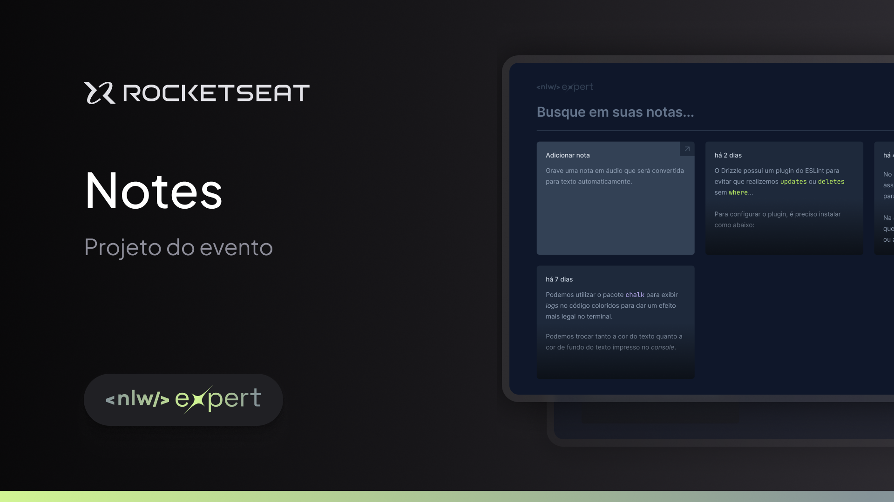

<h2 align="center">Nlw Expert Notes</h2>
 

     <a href="#Tecnologias">Tecnologias</a> • 
     <a href="#Como usar">Como usar</a> • 
      •
     <a href="#Licença">Licença</a> 

 
Uma aplicação de notas que permite a criação de anotações por meio da API de reconhecimento de fala nativa do navegador, utilizando o áudio como entrada.
 

## 🌄 Layout

 

## 🛠 Tecnologias

Abaixo tecnologias que foram usadas no projeto

- React
- Typescript
- Tailwindcss
- Git e Github
- Vercel
- SpeechRecognition API

## 📽️ Veja funcionando
<a href='https://notes-audio.vercel.app/'>Projeto online</a>

 

## 👨‍💻 Colaboradores

<table>
    <tr>
         <td align="center"><a href="https://brunogoncalvesferreira.com"> <b>Bruno Gonçalves</b></a> <a href="https://brunogoncalvesferreira.com" title="Bruno Gonçalves Ferreira">👨‍🚀</a></td>
    </tr>
</table>

 

## ✅ Licença

[MIT](https://choosealicense.com/licenses/mit/)
